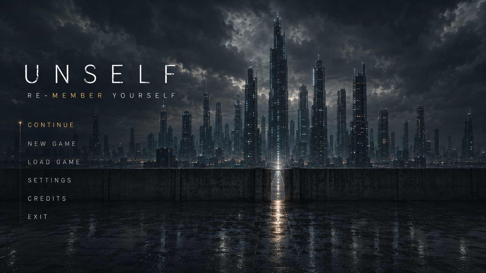

  

  <strong>UNSELF</strong> 
  <i>You are what remains.</i>

# UNSELF

**RE-MEMBER YOURSELF**

UNSELF is a first-person immersive sim with psychological horror and cyberpunk elements.

You are not a whole person.

Identity in this world can be installed, replaced, suppressed, corrupted and weaponized. Specialized personality fragments called **Members** alter perception, behavior and available actions.

The player enters the world through an external control layer called **Y.O.U.**, sharing a body with an existing identity known as **I**.

The central question is not who controls the body.

It is what remains when control, memory and identity can no longer be separated.

---

## Genre

- First-person immersive sim
- Psychological horror
- Cyberpunk
- Single-player
- PC

---

## Gameplay Philosophy

UNSELF is designed around systemic problem solving rather than fixed solutions.

A locked path may be bypassed through technical access, force, social manipulation, observation, environmental exploitation or a completely different route.

The correct solution is not defined by the game.

The available solution depends on who you have chosen to become.

Combat, exploration, dialogue and technical interaction are all affected by the active Member configuration.

---

## Themes

UNSELF explores:

- Identity
- Memory
- Agency
- Artificial personality
- Corporate ownership of the self
- Grief
- Replacement
- Control
- The boundary between player and character

The game does not treat these ideas as background lore.

They are embedded directly into the mechanics.

---

## Technology

- Unity 6
- C#
- Universal Render Pipeline
- Windows PC

---

## Status

UNSELF is currently in development.

The project is focused on building a compact vertical slice before expanding into a larger game.
